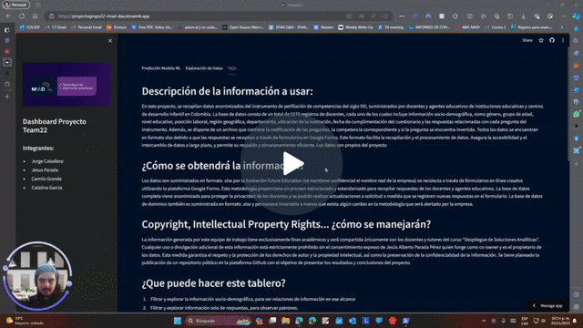
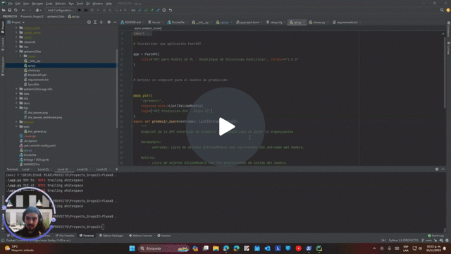

# Proyecto_Grupo22
Proyecto Grupo 22 - DSA - MIAD

[](figs/dsa_banner.png)

[](https://github.com/JECaballeroR/Proyecto_Grupo22/actions/workflows/tests.yml)
[](https://github.com/psf/black)


# Video general del proyecto
[](https://www.loom.com/share/913ee3de3548443a828c639ae0f0d4b8)

# Alcance

### Productos resultado del proyecto de Analytics que responde al problema de Negocio:
1. Tablero de Control
    * Pestaña de interacción con Modelo de ML desarrollado. La pestaña debe tomar las entradas definidas y devolver la predicción del modelo
    * Pestaña de exploración. Debe permitir filtrar y explorar los datos de entrada. Idealmente, priorizar mostrar los datos asociados al modelo
    * Disponible en la nube
1. API Modelo
    * Se debe separar el modelo del tablero. La API debe idealmente, poder recibir peticiones en masa así el Front End no las requiera inmediatamente.
    * Debe poderse fácilmente cambiar el modelo, para procesos de re validación
    *    Disponible en la nube.
1. Documentación:
* Instalación y re-despliegue
* General, a funcionalidad del código
* Importancia del valor generado.

# Guía de Deployment

A continuación, se presenta una guía para instalar el tablero y la API.
## API:
1. Crear una instancia de una máquina virtual. Ubuntu Server con al menos 10GB de disco.
1. Conectarse al terminal de la Instancia.
1. Clonar el repositorio.
```
git clone https://github.com/JECaballeroR/Proyecto_Grupo22.git
```
4.  Ir a la carpeta en que se clonó
```
cd ruta/a/la/carpeta
```
5. En la máquina virtual, elimine versiones anteriores de Docker (esto genera un error si no hay
 versiones anteriores, en cuyo caso puede continuar sin problema)
```
sudo apt-get remove docker docker-engine docker.io containerd runc
```
6. Actualice el índice de paquetes
```
sudo apt-get update
```
7. Instalar dependencias de interés:
```
sudo apt-get install ca-certificates curl gnupg
```
8. Agregar llave de docker:
```
sudo install -m 0755 -d /etc/apt/keyrings
 curl -fsSL https://download.docker.com/linux/ubuntu/gpg | sudo gpg --dearmor -o /etc/apt/keyrings/docker.gpg
 sudo chmod a+r /etc/apt/keyrings/docker.gpg
```
9. Añadir repositorio de Docker al sistema para instalación:

```

 echo  "deb [arch="$(dpkg --print-architecture)" signed-by=/etc/apt/keyrings/docker.gpg] https://download.docker.com/linux/ubuntu  "$(. /etc/os-release && echo "$VERSION_CODENAME")" stable" |  sudo tee /etc/apt/sources.list.d/docker.list > /dev/null

```

10. Actualice el índice de paquetes nuevamente
```
sudo apt-get update
```
11. Instale Docker Engine, containerd, y Docker Compose
```
sudo apt-get install docker-ce docker-ce-cli containerd.io docker-buildx-plugin docker-compose-plugin
```
12. Ir a la carpeta con el Dockerfile, en este caso
```
cd Proyecto_Grupo22
```
13. Construya la imagen a partir del dockerfile del repo:
```
sudo docker build -t api-grupo22:latest .
```
14. Ejecute el contenedor usando la imagen creada:
```
sudo docker run -p 8001:8001 -it -e PORT=8001 api-grupo22
```
15. Para su Máquina Virtual, modifique el grupo de seguridad
    para permitir tráfico por el puerto 8001. Es decir, en el grupo de seguridad de la máquina edite las
 reglas de entrada y agregue una que permita tráfico por el puerto TCP 8001 desde cualquier IP
 (anywhere IPv4).
    
16. Copie la IP pública de su máquina y en un navegador local visite la página IP:8001. Allí debe
 aparecer la API en ejecución
    
## Dashboard:
1. Clonar el repositorio
1. Crear una cuenta en https://share.streamlit.io/
1. Dale permisos a Streamlit share sobre tus repos de github
1. Desde el workspace, click en "New App" en la esquina superior izquierda:

[](https://docs.streamlit.io/images/streamlit-community-cloud/deploy-empty-new-app.png
)
3. Elige el nombre del repo, branch y el archivo. Puedes usar también "Paste GitHub URL" 
   y pegar el link al archivo .py con la app de streamlit.
   
1. Streamlit genera una URL con un Random Hash. Cambia la URL de la app

[](https://docs.streamlit.io/images/streamlit-community-cloud/deploy-an-app.png
)   
5. Da clic en opciones avanzadas. Especifica que la app corra en python 3.9 y 
   agrega un el secreto URL_API='IP de la API', donde 'IP de la API' es la IP del endpoint predict de tu API
   (p.e., http://123.456.0.1/predict)
   
1. Observa a la app lanzarse.

[](https://docs.streamlit.io/images/streamlit-community-cloud/deploy-an-app-provisioning.png
)   

7. Para actualizar tu app, **Haz un push a la rama del proyecto que elegiste en tu deployment**.
Streamlit monitorea y actualiza la app al hacer un push.

# Explicación del código    

A continuación, se tiene un video de la estructura y el funcionamiento del código.
Internamente, el código se encuentra comentado. El video sirve más de explicación de decisiones de arquitectura 
y funcionalidad del mismo.
[](https://www.loom.com/share/10be3f45d9c440c1832669c748f663a9)
